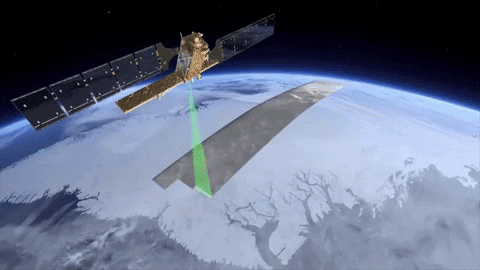

# Seja bem vindo ao meu GitHub! 

 👨🏻‍💻 **Sobre mim** 

Sou uma pessaoa que gosta de geotecnologias, graduando da UFSM em <a href="https://www.ufsm.br/cursos/graduacao/santa-maria/tecnologia-em-geoprocessamento">Geoprocessamento</a>, focado em Google Earth Engine e Python para Análises Geoespaciais

- Tecnólogo em Análise e Desenvolvimento de Sistemas.
- Pós-Gradução Lato Sensu Administração de Banco de Dados.
- Aluno da <a href="https://www.rocketseat.com.br/">Rocketseat</a> nas formações ReactJS, React Native e  Node.js.

  
 
---

  
&nbsp;
&nbsp;
&nbsp;
&nbsp;
&nbsp;
&nbsp;
&nbsp;
&nbsp;
&nbsp;

---

🤝🏻 **Conecte-se comigo**

